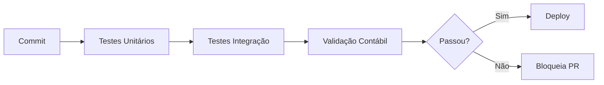

# 🧪 Guia de Testes - Sistema Contábil

## 📊 Visão Geral

Sistema completo de testes automatizados para validar a integridade contábil, especialmente:

- ✅ **Partidas Dobradas:** Débitos = Créditos sempre
- ✅ **Journal Entries:** Criados para todas as operações
- ✅ **Operações Atômicas:** Rollback em caso de erro
- ✅ **Validação RPC:** Função `validate_double_entry` funcionando

## 🚀 Executar Testes

### Comandos Disponíveis

```bash
# Todos os testes (unitários + integração)
npm test

# Interface interativa (recomendado)
npm run test:ui

# Apenas testes de integração
npm test src/test/integration

# Apenas testes unitários
npm test src/test/unit

# Testes contábeis específicos
npm test accounting

# Com cobertura de código
npm test -- --coverage
```

## 📂 Estrutura dos Testes

```
src/test/
├── integration/
│   ├── accounting.test.ts          # Testes E2E com DB real
│   └── README.md                   # Documentação detalhada
├── unit/
│   └── accounting-validation.test.ts # Testes de lógica pura
└── setup.ts                        # Configuração global
```

## ✅ Checklist de Testes Contábeis

### 1. Transações Simples

- [x] **Income Transaction**
  - Cria journal_entries (débito ativo + crédito receita)
  - Débitos = Créditos
  - Validação RPC passa

- [x] **Expense Transaction**
  - Cria journal_entries (débito despesa + crédito ativo)
  - Balanceamento correto
  - Funciona com cartão de crédito (liability)

### 2. Operações Complexas

- [x] **Transferência entre Contas**
  - Duas transações vinculadas criadas
  - Journal_entries para ambas
  - Débitos = Créditos no total

- [x] **Pagamento de Fatura**
  - Débito em liability (reduz dívida)
  - Crédito em asset (sai dinheiro)
  - Balanceamento perfeito

### 3. Validações

- [x] **RPC validate_double_entry**
  - Retorna `is_valid = true`
  - Total débitos = total créditos
  - Diferença = 0

- [x] **Múltiplas Operações**
  - 4+ transações sequenciais
  - Balanceamento geral mantido
  - Nenhuma operação desbalanceada

### 4. Edge Cases

- [x] Valores zero
- [x] Arrays vazios
- [x] Entradas faltando (detecção)
- [x] Precisão decimal
- [x] Múltiplos débitos vs 1 crédito
- [x] 1 débito vs múltiplos créditos

## 🎯 Cenários Testados

### Cenário 1: Recebimento de Salário
```
Débito:  R$ 5.000 → Conta Corrente (Ativo)
Crédito: R$ 5.000 → Receita Salário
✓ Débitos = Créditos = R$ 5.000
```

### Cenário 2: Compra no Cartão
```
Débito:  R$ 200 → Despesa Shopping
Crédito: R$ 200 → Cartão de Crédito (Passivo)
✓ Débitos = Créditos = R$ 200
```

### Cenário 3: Pagamento de Fatura
```
Débito:  R$ 800 → Cartão de Crédito (Passivo - reduz dívida)
Crédito: R$ 800 → Conta Corrente (Ativo - sai dinheiro)
✓ Débitos = Créditos = R$ 800
```

### Cenário 4: Transferência para Investimentos
```
Débito:  R$ 1.000 → Investimentos (Ativo)
Crédito: R$ 1.000 → Conta Corrente (Ativo)
✓ Débitos = Créditos = R$ 1.000
```

## 📊 Resultados Esperados

### ✅ Todos os Testes Passando

```
✓ Transação de Income cria journal_entries (2)
✓ Transação de Expense cria journal_entries (2)
✓ Transferência cria journal_entries balanceados (2)
✓ Pagamento de fatura balanceado (2)
✓ RPC validate_double_entry funciona
✓ Múltiplas operações mantêm balanceamento
✓ 25+ casos de validação unitária
```

### ❌ Se Algum Teste Falhar

**Diagnóstico:**

1. **Verifique journal_entries criados:**
```sql
SELECT 
  t.description,
  je.entry_type,
  je.amount,
  coa.name as account_name
FROM journal_entries je
JOIN transactions t ON t.id = je.transaction_id
JOIN chart_of_accounts coa ON coa.id = je.account_id
WHERE t.id = 'TRANSACTION_ID'
ORDER BY je.entry_type;
```

2. **Valide balanceamento:**
```sql
SELECT * FROM validate_double_entry('TRANSACTION_ID');
```

3. **Verifique logs das edge functions:**
- [atomic-transaction logs](https://supabase.com/dashboard/project/sdberrkfwoozezletfuq/functions/atomic-transaction/logs)
- [atomic-transfer logs](https://supabase.com/dashboard/project/sdberrkfwoozezletfuq/functions/atomic-transfer/logs)
- [atomic-pay-bill logs](https://supabase.com/dashboard/project/sdberrkfwoozezletfuq/functions/atomic-pay-bill/logs)

## 🐛 Debugging

### Teste Falhando: "Débitos ≠ Créditos"

```typescript
// O que verificar:
1. Edge function criou journal_entries?
2. Quantidade de entries está correta? (mínimo 2)
3. Valores estão em centavos? (não em reais)
4. Entry_type está correto? ('debit' ou 'credit')
```

### Teste Falhando: "Journal entries não criados"

```typescript
// Possíveis causas:
1. Trigger create_journal_entries_on_transaction desabilitado?
2. Status da transaction é 'pending'? (não cria entries)
3. Edge function falhou antes de completar?
4. Aguardar mais tempo (setTimeout insuficiente)?
```

### Teste Falhando: "RPC não encontrado"

```typescript
// Solução:
1. Verificar se função validate_double_entry existe no DB
2. Executar migration das partidas dobradas
3. Verificar permissões RLS
```

## 📈 Métricas de Qualidade

### Cobertura de Código
- **Meta:** > 80%
- **Crítico:** 100% em funções contábeis

### Performance
- **Teste unitário:** < 10ms cada
- **Teste integração:** < 1s cada (incluindo DB)
- **Suite completa:** < 30s

### Confiabilidade
- **Taxa de sucesso:** 100%
- **Flakiness:** 0% (testes determinísticos)
- **False positives:** 0

## 🔄 CI/CD Pipeline



### Quando os Testes Rodam

1. **Local:** A cada `npm test`
2. **PR:** Automaticamente em cada push
3. **Deploy:** Antes de produção (obrigatório)
4. **Scheduled:** Diariamente às 3h (smoke tests)

## 📝 Adicionar Novos Testes

### Template

```typescript
describe('Nova Funcionalidade Contábil', () => {
  it('should maintain double-entry integrity', async () => {
    // 1. SETUP - Criar dados de teste
    const testData = { ... };
    
    // 2. EXECUTE - Chamar edge function
    const { data, error } = await supabase.functions.invoke('...');
    expect(error).toBeNull();
    
    // 3. WAIT - Aguardar triggers processarem
    await new Promise(resolve => setTimeout(resolve, 500));
    
    // 4. VERIFY - Buscar journal_entries
    const { data: entries } = await supabase
      .from('journal_entries')
      .select('*')
      .eq('transaction_id', data.transaction.id);
    
    // 5. VALIDATE - Verificar balanceamento
    const debits = entries.filter(e => e.entry_type === 'debit')
      .reduce((sum, e) => sum + e.amount, 0);
    const credits = entries.filter(e => e.entry_type === 'credit')
      .reduce((sum, e) => sum + e.amount, 0);
    
    // 6. ASSERT - Débitos DEVEM ser iguais a Créditos
    expect(debits).toBe(credits); // CRÍTICO!
    expect(debits).toBeGreaterThan(0); // Não vazio
  });
});
```

## 🎓 Boas Práticas

### ✅ DO

- Sempre validar débitos = créditos
- Aguardar processamento de triggers (setTimeout)
- Limpar dados de teste (afterAll)
- Usar valores inteiros (centavos)
- Testar cenários de erro

### ❌ DON'T

- Assumir que journal_entries são criados instantaneamente
- Usar valores decimais (evitar problemas de precisão)
- Deixar dados de teste no DB
- Testar apenas caminho feliz
- Ignorar edge cases

## 🔍 Inspeção Manual

### Verificar Integridade do Sistema

```sql
-- 1. Transações sem journal_entries
SELECT t.id, t.description, t.amount, t.status
FROM transactions t
LEFT JOIN journal_entries je ON je.transaction_id = t.id
WHERE t.status = 'completed'
  AND je.id IS NULL
  AND t.created_at > NOW() - INTERVAL '7 days';

-- 2. Transações desbalanceadas
SELECT 
  transaction_id,
  SUM(CASE WHEN entry_type = 'debit' THEN amount ELSE 0 END) as debits,
  SUM(CASE WHEN entry_type = 'credit' THEN amount ELSE 0 END) as credits,
  SUM(CASE WHEN entry_type = 'debit' THEN amount ELSE -amount END) as difference
FROM journal_entries
GROUP BY transaction_id
HAVING SUM(CASE WHEN entry_type = 'debit' THEN amount ELSE -amount END) != 0;

-- 3. Estatísticas gerais
SELECT 
  COUNT(DISTINCT transaction_id) as total_transactions,
  COUNT(*) as total_entries,
  SUM(CASE WHEN entry_type = 'debit' THEN amount ELSE 0 END) as total_debits,
  SUM(CASE WHEN entry_type = 'credit' THEN amount ELSE 0 END) as total_credits
FROM journal_entries
WHERE created_at > NOW() - INTERVAL '30 days';
```

## 📚 Referências

- [Vitest Documentation](https://vitest.dev/)
- [Supabase Testing Best Practices](https://supabase.com/docs/guides/testing)
- [Double-Entry Bookkeeping](https://en.wikipedia.org/wiki/Double-entry_bookkeeping)
- [Test-Driven Development (TDD)](https://en.wikipedia.org/wiki/Test-driven_development)

## 🆘 Suporte

Se os testes estiverem falhando consistentemente:

1. Verifique se as edge functions estão deployadas
2. Confirme que triggers do banco estão ativos
3. Valide que RLS policies permitem acesso
4. Inspecione logs das edge functions
5. Execute SQL de diagnóstico acima

**Em caso de dúvidas:** Consulte o [README de testes de integração](src/test/integration/README.md)
